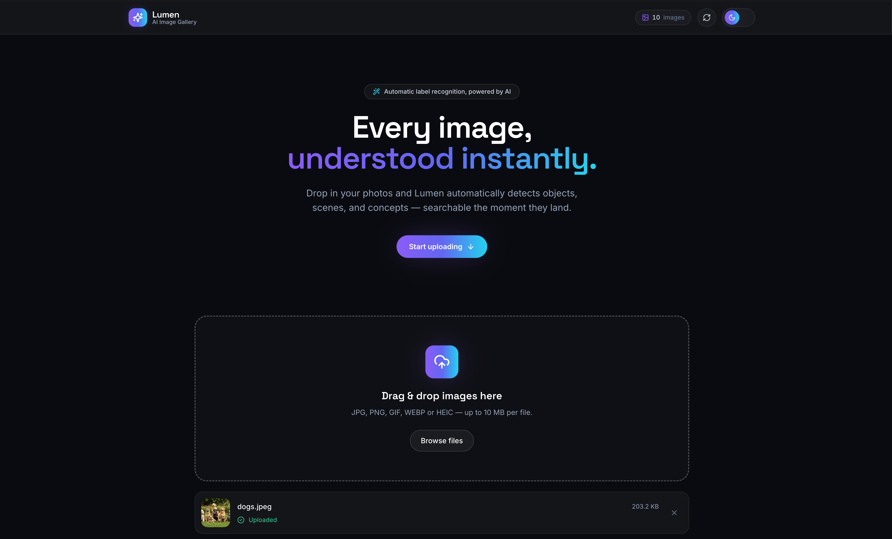
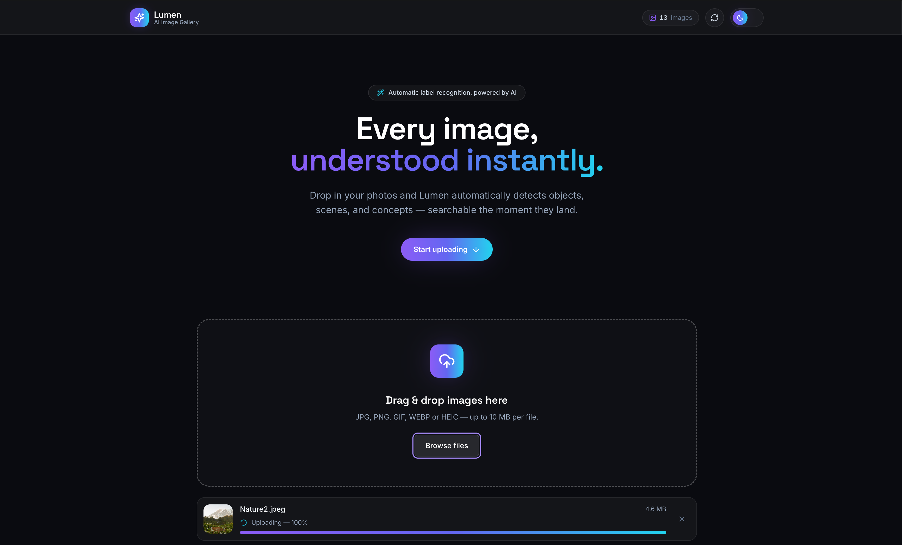
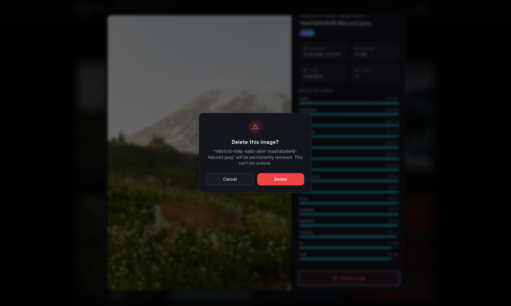
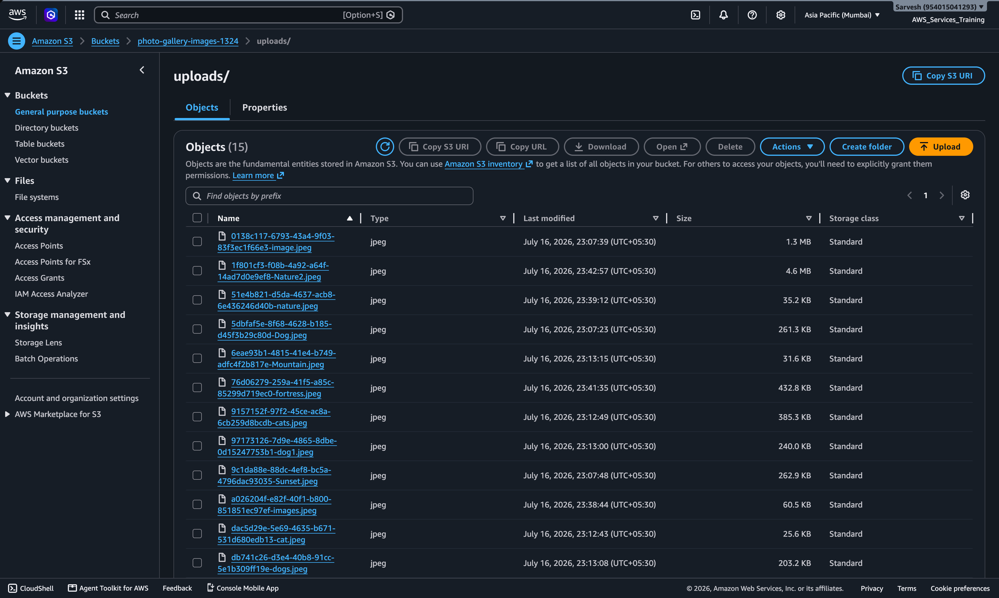
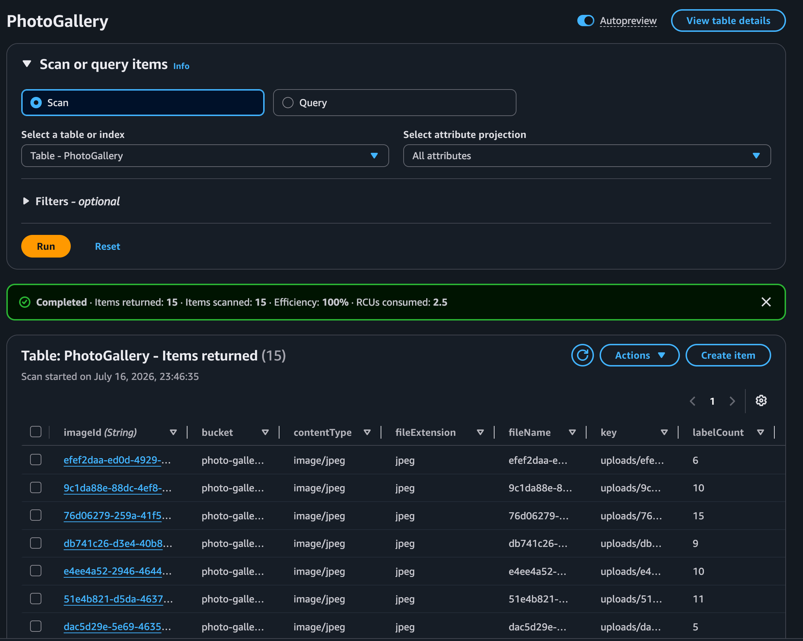

# 📸 AI Photo Gallery Website

A modern serverless AI-powered photo gallery built on AWS. Users can upload images directly to Amazon S3 using pre-signed URLs, where every uploaded image is automatically analyzed using Amazon Rekognition. The detected labels are stored in Amazon DynamoDB and displayed in a responsive gallery with search functionality.

This project demonstrates the implementation of a complete event-driven serverless architecture using AWS services together with a modern React frontend.

---

# ✨ Features

- Modern responsive React frontend
- Drag & Drop image uploads
- Direct upload to Amazon S3 using Pre-Signed URLs
- Automatic image analysis using Amazon Rekognition
- Metadata storage in Amazon DynamoDB
- Search images using Rekognition labels
- Full-screen image preview modal
- Delete images from both S3 and DynamoDB
- Responsive gallery layout
- Upload progress indicator
- Light/Dark theme support
- Automated deployment using AWS CodePipeline & CodeBuild

---

# 🛠 AWS Services Used

| Service | Purpose |
|----------|----------|
| Amazon S3 | Store uploaded images and host frontend |
| AWS Lambda | Backend business logic |
| Amazon API Gateway | REST API endpoints |
| Amazon Rekognition | Image label detection |
| Amazon DynamoDB | Store image metadata |
| AWS CodeBuild | Build React application |
| AWS CodePipeline | Automatic CI/CD deployment |
| IAM | Secure permissions between services |

---

# 🏗 Project Architecture

```text
                    React Frontend
                          │
                          ▼
                  Amazon API Gateway
                          │
          ┌───────────────┼───────────────┐
          │               │               │
          ▼               ▼               ▼
 Upload URL Lambda   Gallery Lambda   Delete Lambda
          │               ▲               │
          ▼               │               ▼
      Pre-Signed URL      │         Delete Metadata
          │               │
          ▼               │
      Amazon S3 ──────────┘
          │
   Object Created Event
          │
          ▼
 Process Image Lambda
          │
          ▼
 Amazon Rekognition
          │
          ▼
 Amazon DynamoDB
```

---

# ⚙ System Workflow

1. User selects an image.
2. Frontend requests a pre-signed upload URL.
3. Upload URL Lambda generates the URL.
4. Browser uploads the image directly to Amazon S3.
5. S3 triggers the Process Image Lambda.
6. Process Image Lambda calls Amazon Rekognition.
7. Rekognition detects labels in the image.
8. Image metadata is stored inside DynamoDB.
9. Gallery Lambda retrieves the metadata.
10. Frontend displays the searchable gallery.

---

# 📷 Application Screenshots

## Home Page



---

## Upload Progress

Shows real-time upload progress while the image is being uploaded directly to Amazon S3.



---

## Gallery View

Displays all uploaded images retrieved dynamically from DynamoDB.


---

## Image Details

Displays image preview together with labels detected by Amazon Rekognition.


---

## Search by Label

Images can be searched using Rekognition generated labels.


---

## Delete Confirmation

Users can remove an image from both Amazon S3 and DynamoDB.



---

# ☁ Backend Infrastructure

## Amazon S3

Stores uploaded images securely.



---

## Amazon DynamoDB

Stores image metadata generated after Rekognition analysis.



---

## AWS CodePipeline

Automatic deployment pipeline for the frontend.


---

# 🔗 REST API

| Method | Endpoint | Description |
|----------|------------------|-------------------------------|
| POST | `/upload-url` | Generate pre-signed upload URL |
| GET | `/gallery` | Retrieve gallery |
| GET | `/gallery?search=label` | Search images |
| DELETE | `/image/{imageId}` | Delete image |

---

# 💻 Technology Stack

### Frontend

- React 19
- TypeScript
- Vite
- Tailwind CSS
- Framer Motion
- React Dropzone
- Lucide React
- React Hot Toast

### Backend

- AWS Lambda
- Amazon API Gateway
- Amazon Rekognition
- Amazon DynamoDB
- Amazon S3

### DevOps

- AWS CodeBuild
- AWS CodePipeline
- GitHub

---

# 📂 Repository Structure

```text
.
├── src/
├── lambda functions/
├── project_images/
├── buildspec.yml
├── package.json
├── README.md
└── ...
```

---

# 🚀 CI/CD Pipeline

Every push to the GitHub repository automatically triggers:

```
GitHub
    │
    ▼
AWS CodePipeline
    │
    ▼
AWS CodeBuild
    │
    ▼
Vite Production Build
    │
    ▼
Amazon S3 Static Website Hosting
```

This ensures that every code change is automatically built and deployed without manual intervention.

---

# 🎯 Learning Outcomes

This project demonstrates practical implementation of:

- Serverless Architecture
- Event Driven Computing
- REST API Development
- AWS Lambda
- Amazon Rekognition Integration
- DynamoDB Operations
- Secure S3 Uploads using Pre-Signed URLs
- CI/CD using AWS CodePipeline
- Modern React Development
- Cloud-based Image Processing

---

# 👨‍💻 Author

**Sarvesh**

Engineering Student

AWS Serverless Project
